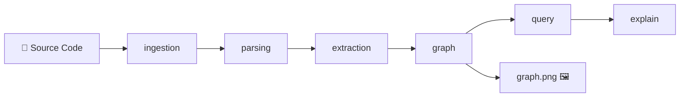

# PA — Code Intelligence System: Phân tích toàn bộ Project

## Tổng quan

**PA (Project Assistant)** là một hệ thống phân tích mã nguồn Python tĩnh (static analysis). Nó quét một codebase, trích xuất các hàm và mối quan hệ gọi nhau giữa chúng, sau đó xây dựng một "bản đồ" (đồ thị có hướng) để trực quan hóa cấu trúc code.

Hiện tại đang ở **Phase 1 — Foundation**: chỉ dùng Python thuần + thư viện `ast` (có sẵn) và `networkx` (đồ thị), **không dùng AI/LLM** để phân tích.

---

## Kiến trúc tổng thể



Luồng dữ liệu đi **từ trái sang phải** qua 5 module chính, mỗi module chịu trách nhiệm một bước duy nhất.

---

## Chi tiết từng Module

### 1. `ingestion/` — Quét file

| File | Hàm | Nhiệm vụ |
|------|------|-----------|
| [file_scanner.py](file:///c:/Users/Admin/OneDrive/Tài%20liệu/PA/ingestion/file_scanner.py) | `scan_py_files(root)` | Tìm tất cả file `.py` trong thư mục (đệ quy), bỏ qua `venv`, `__pycache__`, `.git`, `tests` |

**Input:** Đường dẫn thư mục hoặc file đơn lẻ
**Output:** Danh sách đường dẫn các file `.py`

```python
# Ví dụ
scan_py_files(".")
# → ["app/main.py", "ingestion/file_scanner.py", "parsing/parser.py", ...]
```

---

### 2. `parsing/` — Đọc cú pháp

| File | Hàm | Nhiệm vụ |
|------|------|-----------|
| [parser.py](file:///c:/Users/Admin/OneDrive/Tài%20liệu/PA/parsing/parser.py) | `parse_file(path)` | Đọc file Python và chuyển thành cây cú pháp trừu tượng (AST) |

**Input:** Đường dẫn 1 file `.py`
**Output:** `ast.AST` — cây cú pháp mà Python tự phân tích

> [!NOTE]
> Module `ast` là thư viện có sẵn của Python. Nó đọc source code và biến thành một cấu trúc dữ liệu dạng cây, giúp chương trình "hiểu" code mà không cần chạy code đó.

---

### 3. `extraction/` — Trích xuất thông tin

| File | Hàm/Class | Nhiệm vụ |
|------|-----------|-----------|
| [models.py](file:///c:/Users/Admin/OneDrive/Tài%20liệu/PA/extraction/models.py) | `Function`, `FileModule` | Định nghĩa cấu trúc dữ liệu |
| [extractor.py](file:///c:/Users/Admin/OneDrive/Tài%20liệu/PA/extraction/extractor.py) | `extract(tree, file_path)` | Duyệt AST, tìm các hàm và hàm nào gọi hàm nào |

**Input:** Cây AST + đường dẫn file
**Output:** `FileModule` chứa danh sách các `Function`

```python
# Cấu trúc dữ liệu
Function(name="run", file="app/main.py", calls=["scan_py_files", "build_graph", ...])
FileModule(name="app/main.py", functions=[Function(...), ...])
```

> [!IMPORTANT]
> Hiện tại extractor chỉ tìm được các lời gọi hàm dạng đơn giản `func_name()`. Nó **chưa xử lý** được:
> - Gọi qua object: `obj.method()`
> - Gọi qua module: `os.path.join()`
> - Gọi qua biến: `callback()`

---

### 4. `graph/` — Xây dựng đồ thị

| File | Hàm | Nhiệm vụ |
|------|------|-----------|
| [builder.py](file:///c:/Users/Admin/OneDrive/Tài%20liệu/PA/graph/builder.py) | `build_graph(modules)` | Tạo đồ thị có hướng từ danh sách `FileModule` |
| | `visualize_subgraph(graph, func_name, depth)` | Vẽ sơ đồ hình ảnh (PNG) cho một hàm cụ thể |
| | `_collect_nodes(chain)` | Thu thập tất cả node từ kết quả `get_call_chain` (hàm đệ quy) |

**Cách hoạt động của `build_graph`:**

```
Bước 1: Tạo node cho mỗi hàm, format: "file_path::func_name"
        Ví dụ: "app/main.py::run", "ingestion/file_scanner.py::scan_py_files"

Bước 2: Tạo cạnh (edge) khi hàm A gọi hàm B
        Ví dụ: "app/main.py::run" ──→ "ingestion/file_scanner.py::scan_py_files"
```

**Kết quả `graph.png` hiện tại:**


---

### 5. `query/` — Truy vấn đồ thị

| File | Hàm | Nhiệm vụ |
|------|------|-----------|
| [graph_query.py](file:///c:/Users/Admin/OneDrive/Tài%20liệu/PA/query/graph_query.py) | `get_function_calls(graph, func)` | Liệt kê các hàm mà `func` gọi trực tiếp |
| | `get_callers(graph, func)` | Liệt kê các hàm gọi đến `func` ("ai gọi tôi?") |
| | `get_call_chain(graph, func, depth)` | Xây dựng cây gọi đệ quy với phát hiện vòng lặp (cycle) |
| | `format_call_chain(chain)` | Render cây gọi thành sơ đồ cây text đẹp |

**Ví dụ output của `format_call_chain`:**
```
run (main.py)
├── scan_py_files (file_scanner.py)
├── build_graph (builder.py)
├── visualize_subgraph (builder.py)
│   ├── get_call_chain (graph_query.py)
│   └── _collect_nodes (builder.py)
│       └── _collect_nodes (builder.py)  [cycle]   ← đệ quy tự gọi chính nó
├── extract (extractor.py)
├── explain_function (formatter.py)
│   ├── get_call_chain (graph_query.py)
│   └── format_call_chain (graph_query.py)
└── parse_file (parser.py)
```

> [!TIP]
> **Cơ chế phát hiện Cycle:** Hệ thống dùng `frozenset` để theo dõi các node trên đường đi hiện tại. Nếu gặp lại node đã có trên đường đi → đánh dấu `[cycle]` và dừng nhánh đó. Node xuất hiện ở nhánh khác thì **không** bị coi là cycle.

---

### 6. `explain/` — Định dạng output

| File | Hàm | Nhiệm vụ |
|------|------|-----------|
| [formatter.py](file:///c:/Users/Admin/OneDrive/Tài%20liệu/PA/explain/formatter.py) | `explain_function(graph, func)` | Kết hợp `get_call_chain` + `format_call_chain` để tạo output cuối cùng |

---

### 7. `app/` — Điểm khởi chạy

| File | Hàm | Nhiệm vụ |
|------|------|-----------|
| [main.py](file:///c:/Users/Admin/OneDrive/Tài%20liệu/PA/app/main.py) | `run(repo_path)` | Điều phối toàn bộ pipeline: scan → parse → extract → graph → visualize → explain |

**Pipeline trong hàm `run`:**
```python
files    = scan_py_files(repo_path)              # 1. Tìm file .py
modules  = [extract(parse_file(f), f) for f in files]  # 2-3. Parse + Extract
graph    = build_graph(modules)                  # 4. Xây đồ thị
visualize_subgraph(graph, nodes[0], depth=2)     # 5. Vẽ ảnh PNG
print(explain_function(graph, nodes[0]))         # 6. In sơ đồ cây
```

---

## Các folder hỗ trợ (chưa có code logic)

| Folder | Mục đích (theo CLAUDE.md) | Trạng thái |
|--------|---------------------------|------------|
| `agents/` | Định nghĩa các AI agent (orchestrator, researcher, coder, reviewer) | 📋 Chỉ có README template |
| `prompts/` | System prompts và prompt templates | 📋 File rỗng |
| `memory/` | Bộ nhớ lâu dài (user, feedback, project) | 📋 Chỉ có index template |
| `rules/` | Quy tắc hành vi cho agents | ✅ Có `core.md` với quy tắc cơ bản |
| `hooks/` | Automation hooks (event-driven) | 📋 Chưa có nội dung |
| `evals/` | Test cases đánh giá agent | 📋 Chưa có nội dung |
| `config/` | Cấu hình model và môi trường | ✅ Có `settings.json` (claude-sonnet-4-6) |
| `skills/` | Reusable skill definitions | 📋 Có template |
| `scripts/` | Utility scripts | 📋 Chưa có nội dung |

---

## Test coverage

| File test | Module được test | Số test |
|-----------|-----------------|---------|
| [test_file_scanner.py](file:///c:/Users/Admin/OneDrive/Tài%20liệu/PA/tests/unit/test_file_scanner.py) | `ingestion` | 2 |
| [test_parser.py](file:///c:/Users/Admin/OneDrive/Tài%20liệu/PA/tests/unit/test_parser.py) | `parsing` | ~2 |
| [test_extractor.py](file:///c:/Users/Admin/OneDrive/Tài%20liệu/PA/tests/unit/test_extractor.py) | `extraction` | ~4 |
| [test_builder.py](file:///c:/Users/Admin/OneDrive/Tài%20liệu/PA/tests/unit/test_builder.py) | `graph.builder` | 10 |
| [test_graph_query.py](file:///c:/Users/Admin/OneDrive/Tài%20liệu/PA/tests/unit/test_graph_query.py) | `query.graph_query` | 12 |
| [test_formatter.py](file:///c:/Users/Admin/OneDrive/Tài%20liệu/PA/tests/unit/test_formatter.py) | `explain.formatter` | ~3 |

---

## Dependencies

```
pytest==8.1.1        # Test framework
pytest-cov==5.0.0    # Code coverage
networkx==3.2.1      # Thư viện đồ thị
matplotlib           # Vẽ graph.png (chưa có trong requirements.txt!)
```

> [!WARNING]
> `matplotlib` đang được import trong `graph/builder.py` nhưng **chưa được khai báo** trong `requirements.txt`. Nếu ai đó clone project và chạy `pip install -r requirements.txt`, họ sẽ gặp lỗi `ModuleNotFoundError: No module named 'matplotlib'`.

---

## Tóm tắt bằng một câu

**PA là một công cụ quét code Python, tự động xây dựng "bản đồ" các hàm gọi nhau, rồi hiển thị kết quả dưới dạng sơ đồ cây (text) và đồ thị hình ảnh (PNG) — tất cả bằng phân tích tĩnh, không cần chạy code mục tiêu.**
